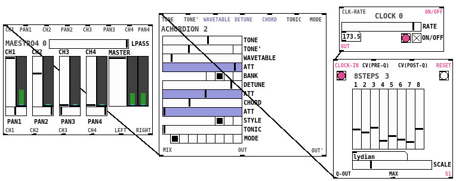

# Automaton

Fork of [Automatonism](https://www.automatonism.com/) 3.0 extended with Zlosynth
modules.

   

# Development

See [DEVELOPMENT.md](DEVELOPMENT.md) to find some basic commands to interact
with the project.

# License

Software of Automatonism is distributed under the terms of the General Public
License version 3. See [LICENSE-SOFTWARE](LICENSE-SOFTWARE) for details.

The project is based on the great [Automatonism](https://www.automatonism.com/),
all kudos to Johan Eriksson.
